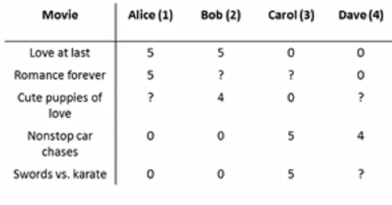

# spark-ml-recommender

Package provides java implementation of big-data recommend-er using Apache Spark

# Feature

* Collaborative filtering recommender that predicts user's preference on unknown items on ALS (Alternating Least Squares)-based gradient descent
* Recommender that computes the correlation / similarity between items based on user preference using Pearson / Cosine / Jaccard correlation coefficient

# Install

Add the following dependency to your POM file:

```xml
<dependency>
  <groupId>com.github.chen0040</groupId>
  <artifactId>spark-ml-recommender</artifactId>
  <version>1.0.2</version>
</dependency>
```

# Usage

* Predict missing ratings 

The sample code below tries to predict the missing rating of [user, movie] as shown in the table below:



```java
JavaSparkContext context = SparkContextFactory.createSparkContext("testing-1");

Table table =new Table();
table.addRating("Love at last", "Alice", 5);
table.addRating("Remance forever", "Alice", 5);
table.addRating("Nonstop car chases", "Alice", 0);
table.addRating("Sword vs. karate", "Alice", 0);
table.addRating("Love at last", "Bob", 5);
table.addRating("Cute puppies of love", "Bob", 4);
table.addRating("Nonstop car chases", "Bob", 0);
table.addRating("Sword vs. karate", "Bob", 0);
table.addRating("Love at last", "Carol", 0);
table.addRating("Cute puppies of love", "Carol", 0);
table.addRating("Nonstop car chases", "Carol", 5);
table.addRating("Sword vs. karate", "Carol", 5);
table.addRating("Love at last", "Dave", 0);
table.addRating("Remance forever", "Dave", 0);
table.addRating("Nonstop car chases", "Dave", 4);

JavaRDD<UserItemRating> input = context.parallelize(table.getRatings());

CFRecommender recommender = new CFRecommender();
recommender.setMaxIterations(50);
recommender.setFeatureCount(2);

JavaRDD<UserItemRating> output = recommender.fitAndTransform(input);

List<UserItemRating> predicted = output.collect();
for(UserItemRating cell : predicted){
 System.out.println("predict(" + cell.getItem() + ", " + cell.getUser() + "): " + cell.getValue());
}
```

* To find the correlation between any two movies using user rating:

```java
JavaSparkContext context = SparkContextFactory.createSparkContext("testing-1");

Table table =new Table();
table.addRating("Love at last", "Alice", 5);
table.addRating("Remance forever", "Alice", 5);
table.addRating("Nonstop car chases", "Alice", 0);
table.addRating("Sword vs. karate", "Alice", 0);
table.addRating("Love at last", "Bob", 5);
table.addRating("Cute puppies of love", "Bob", 4);
table.addRating("Nonstop car chases", "Bob", 0);
table.addRating("Sword vs. karate", "Bob", 0);
table.addRating("Love at last", "Carol", 0);
table.addRating("Cute puppies of love", "Carol", 0);
table.addRating("Nonstop car chases", "Carol", 5);
table.addRating("Sword vs. karate", "Carol", 5);
table.addRating("Love at last", "Dave", 0);
table.addRating("Remance forever", "Dave", 0);
table.addRating("Nonstop car chases", "Dave", 4);

JavaRDD<UserItemRating> input = context.parallelize(table.getRatings());

ItemCorrelationRecommender recommender = new ItemCorrelationRecommender();

JavaRDD<ItemCorrelation> output = recommender.fitAndTransform(input);

List<ItemCorrelation> predicted = output.collect();
for(ItemCorrelation cell : predicted){
 System.out.println("movie-correlation(" + cell.getItem1() + ", " + cell.getItem2() + "): " + cell.getPearson());
}
```
